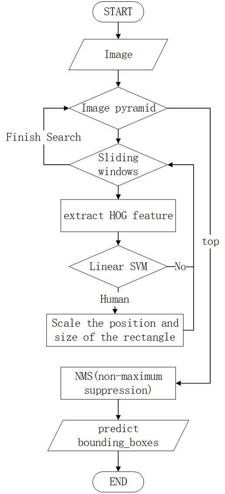
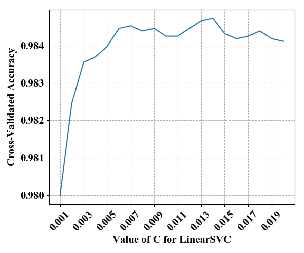

# Human Detection HOG+SVM in INRIA

## Introduction

Human Detection using HOG as descriptor and Linear SVM as classifier, detector using sliding window scans image pyramid, finally, apply NMS(non-maximum suppression) to remove redundant and overlapping bounding boxes.

## Dataset

INRIA Person Dataset link: [http://pascal.inrialpes.fr/data/human/](http://pascal.inrialpes.fr/data/human/)

## Detector Workflow

## CODE

**NOTE:** All python files need to be run **separately**.

Here's to explain what each file does in the order it should be run.

#### Training Classifier

1. ./extract_HOG(HOG+SVM_feature).py # extract all data's(TRAIN & TEST) HOG features to a .npy file(./feature/train.npy & test.npy).
2. ./find_best_LinearSVM(model).py # training Linear SVM model based on the extracted features(TRAIN) using k-fold cross-validation.(get ./model/lin_svm_clf.pkl)
3. ./hard_examples.py # Apply hard-negative mining.(get ./model/lin_svm_clf_hard_examples.pkl)

#### Evaluate Detector

1. ./make_test_data(HOG+SVM_data).py # make all TEST data(/pos & /neg) in a folder(./data) for test use
2. ./get_ground_truth(annotation2Ground_Truth.npy).py # using regular expressions to get the Ground_Truth from the annotation
3. ./predict_bounding_boxes(predict).py # using HOG_SVM_detector predict Human's bounding_boxes in ./data/Test/ which is got by 1.
4. ./evaluate_the_detector.py # using (predict bounding_boxes and Ground_Truth)'s IOU > 0.5 is good to evaluate the detector

**PS:** detect_bounding_boxes.py provides the detector method(don't need to run)

**Bottom line:** I find a blog which is very similar to what I do and perfectly good.

blog link: [https://www.pyimagesearch.com/2014/11/10/histogram-oriented-gradients-object-detection/](https://www.pyimagesearch.com/2014/11/10/histogram-oriented-gradients-object-detection/)

## Result

For the model I trained(./model/lin_svm_clf.pkl & lin_svm_clf_hard_examples.pkl) to detect human, there are some results to share.

For training model, in order to find best parameter C, I use k-fold cross-validation and find that when C=0.014 the cross-validation accuracy reached the highest(98.48%).

Using (predict bounding_boxes and Ground_Truth)'s IOU > 0.5 is good to evaluate the detector. There are 589 Ground Truth and predictions bounding_boxes number is 1110 and the number of correct prediction is 117. Finally, precision and recall and so on as shown in the following table.

|                               | Precision | Recall | False Positive Rate | Miss Rate |
|-------------------------------|-----------|--------|---------------------|-----------|
| lin_svm_clf.pkl               | 10.54%    | 19.86% | 89.46%              | 80.14%    |
| lin_svm_clf_hard_examples.pkl | 14.72%    | 10.70% | 85.28%              | 89.30%    |
